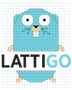
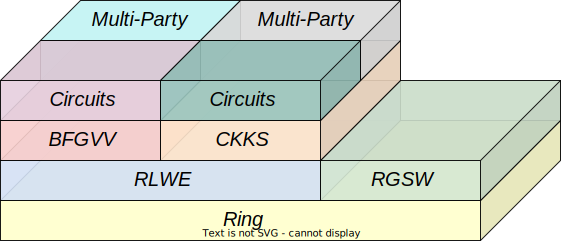

# Lattigo: lattice-based multiparty homomorphic encryption library in Go

<p align="center">
	
</p>


Lattigo is a Go module that implements full-RNS Ring-Learning-With-Errors-based homomorphic-encryption
primitives and Multiparty-Homomorphic-Encryption-based secure protocols. The library features:

- Optimized arithmetic for power-of-two cyclotomic rings.
- Advanced and scheme-agnostic implementation of RLWE-based primitives, key-generation, and their multiparty version.
- Implementation of the BFV/BGV and CKKS schemes and their multiparty version.
- Support for RGSW, external product and LMKCDEY blind rotations.
- A pure Go implementation, enabling cross-platform builds, including WASM compilation for
browser clients, with comparable performance to state-of-the-art C++ libraries.

Lattigo is meant to support HE in distributed systems and microservices architectures, for which Go
is a common choice thanks to its natural concurrency model and portability.

## Library overview

<p align="center" width="100%"">
  
</p>

Lattigo is a strictly hierarchical library whose packages form a linear dependency chain ranging from
low-level arithmetic functionalities to high-level homomorphic circuits. A graphical depiction of the
Lattigo package organization is given in the Figure above.

- `lattigo/ring`: At the lowest level resides the `ring` package providing modular arithmetic operations for polynomials
  in the RNS basis, including: RNS basis extension; RNS rescaling; number theoretic transform (NTT); uniform,
  Gaussian and ternary sampling.
  
  - `lattigo/core`: This package implements the core cryptographic functionalities of the library and builds directly
    upon the arithmetic functionalities provided by the `ring` package:

	- `rlwe`: Common base for generic RLWE-based homomorphic encryption.
      It provides all homomorphic functionalities and defines all structs that are not scheme-specific.
      This includes plaintext, ciphertext, key-generation, encryption, decryption and key-switching, as
      well as other more advanced primitives such as RLWE-repacking.

    - `rgsw`: A Full-RNS variant of Ring-GSW ciphertexts and the external product.
	
- `lattigo/schemes`: The implementation of RLWE-based homomorphic encryption schemes are found in the `schemes` package:

  - `bfv`: A Full-RNS variant of the Brakerski-Fan-Vercauteren scale-invariant homomorphic
    encryption scheme. This scheme is instantiated via a wrapper of the `bgv` scheme. 
    It provides modular arithmetic over the integers.

  - `bgv`: A Full-RNS generalization of the Brakerski-Fan-Vercauteren scale-invariant (BFV) and 
    Brakerski-Gentry-Vaikuntanathan (BGV) homomorphic encryption schemes. 
    It provides modular arithmetic over the integers.
  	
  - `ckks`: A Full-RNS Homomorphic Encryption for Arithmetic for Approximate Numbers (HEAAN,
    a.k.a. CKKS) scheme. It provides fixed-point approximate arithmetic over the complex numbers (in its classic
    variant) and over the real numbers (in its conjugate-invariant variant).
	
- `lattigo/circuits`: The circuits package provides implementation of a select set of homomorphic circuits for
  the `bgv` and `ckks` cryptosystems:
  
  - `bgv/lintrans`, `ckks/lintrans`: Arbitrary linear transformations and slot permutations for both `bgv` and `ckks`.
    Scheme-generic objects and functions are part of `common/lintrans`.

  - `bgv/polynomial`, `ckks/polynomial`: Polynomial evaluation circuits for `bgv` and `ckks`.
    Scheme-generic objects and functions are part of `common/polynomial`.
	
  - `ckks/minimax`: Minimax composite polynomial evaluator for `ckks`.
  
  - `ckks/comparison`: Homomorphic comparison-based circuits such as `sign`, `max` and `step` for the `ckks` scheme.
  
  - `ckks/inverse`: Homomorphic inverse circuit for `ckks`.
  
  - `ckks/mod1`: Homomorphic circuit for the `mod1` function using the `ckks` cryptosystem.
  
  - `ckks/dft`: Homomorphic Discrete Fourier Transform circuits for the `ckks` scheme.
  
  - `ckks/bootstrapping`: Bootstrapping for fixed-point approximate arithmetic over the real
     and complex numbers, i.e., the `ckks` scheme, with support for the Conjugate Invariant ring, batch bootstrapping with automatic
     packing/unpacking of sparsely packed/smaller ring degree ciphertexts, arbitrary precision bootstrapping,
     and advanced circuit customization/parameterization.

- `lattigo/multiparty`: Package for multiparty (a.k.a. distributed or threshold) key-generation and 
  interactive ciphertext bootstrapping with secret-shared secret keys.

  - `mpckks`: Homomorphic decryption and re-encryption from and to Linear-Secret-Sharing-Shares, 
    as well as interactive ciphertext bootstrapping for the `schemes/ckks` package.

  - `mpbgv`: Homomorphic decryption and re-encryption from and to Linear-Secret-Sharing-Shares, 
    as well as interactive ciphertext bootstrapping for the `schemes/bgv` package.

- `lattigo/examples`: Executable Go programs that demonstrate the use of the Lattigo library. Each
                      subpackage includes test files that further demonstrate the use of Lattigo
                      primitives.

- `lattigo/utils`: Generic utility methods. This package also contains the following sub-pacakges:
  - `bignum`: Arbitrary precision linear algebra and polynomial approximation.
  - `buffer`: Efficient methods to write/read on `io.Writer` and `io.Reader`.
  - `factorization`: Various factorization algorithms for medium-sized integers.
  - `sampling`: Secure bytes sampling.
  - `structs`: Generic structs for maps, vectors and matrices, including serialization.

### Documentation

The full documentation of the individual packages can be browsed as a web page using official
Golang documentation rendering tool `pkgsite` or browsing the [Go doc](https://pkg.go.dev/github.com/tuneinsight/lattigo/v6).

```bash
$ go install golang.org/x/pkgsite/cmd/pkgsite@latest
$ cd lattigo
$ pkgsite -open .
```

## Versions and Roadmap

The Lattigo library was originally exclusively developed by the EPFL Laboratory for Data Security
until its version 2.4.0.

Starting with the release of version 3.0.0, Lattigo is maintained and supported by [Tune Insight
SA](https://tuneinsight.com).

Also starting with from version 3.0.0, the module name has changed to
`github.com/tuneinsight/lattigo/v[X]`, and the official repository has been moved to
https://github.com/tuneinsight/lattigo. This has the following implications for modules that depend
on Lattigo:
- Modules that require `github.com/ldsec/lattigo/v2` will still build correctly.
- To upgrade to a version X.y.z >= 3.0.0, depending modules must require `github.com/tuneinsight/lattigo/v[X]/`,
  for example by changing the imports to `github.com/tuneinsight/lattigo/v[X]/[package]` and by
  running `go mod tidy`.

The current version of Lattigo, (v6.x.x) is fast-evolving and in constant development. Consequently,
there will still be backward-incompatible changes within this major version, in addition to many bug
fixes and new features. Hence, we encourage all Lattigo users to update to the latest Lattigo version.


See CHANGELOG.md for the current and past versions.

## Stability

To keep a comprehensive history, we prioritize rebases over merges for branches other than `main`.
Branches with the prefix `dev_` are branches in active development and will be frequently rebased.
Hence, we don't recommend depending on them.

## Pull Requests

External pull requests should only be used to propose new functionalities that are substantial and would
require a fair amount of work if done on our side. If you plan to open such a pull request, please contact
us before doing so to make sure that the proposed changes are aligned with our development roadmap.

External pull requests only proposing small or trivial changes will be converted to an issue and closed.

External contributions will require the signature of a Contributor License Agreement (CLA).
You can contact us using the following email to request a copy of the CLA: [lattigo@tuneinsight.com](mailto:lattigo@tuneinsight.com).

## Bug Reports

Lattigo welcomes bug/regression reports of any kind that conform to the preset template, which is
automatically generated upon creation of a new empty issue. Nonconformity will result in the issue
being closed without acknowledgement.


## License

Lattigo is licensed under the Apache 2.0 License. See [LICENSE](https://github.com/tuneinsight/lattigo/blob/master/LICENSE).

## Contact

Before contacting us directly, please make sure that your request cannot be handled through an issue.

If you want to contribute to Lattigo or report a security issue, you have a feature proposal or request, or you simply want to contact us directly, please do so using the following email: [lattigo@tuneinsight.com](mailto:lattigo@tuneinsight.com).

## Citing

Please use the following BibTex entry for citing Lattigo:

    @misc{lattigo,
	    title = {Lattigo v6},
	    howpublished = {Online: \url{https://github.com/tuneinsight/lattigo}},
	    month = Aug,
	    year = 2024,
	    note = {EPFL-LDS, Tune Insight SA}
    }
    

The Lattigo logo is a lattice-based version of the original Golang mascot by [Renee
French](http://reneefrench.blogspot.com/).
